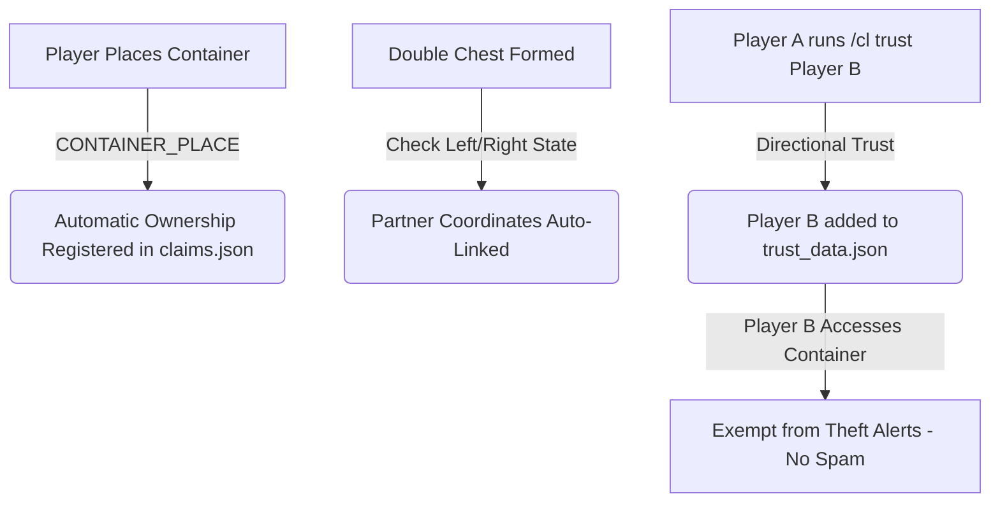
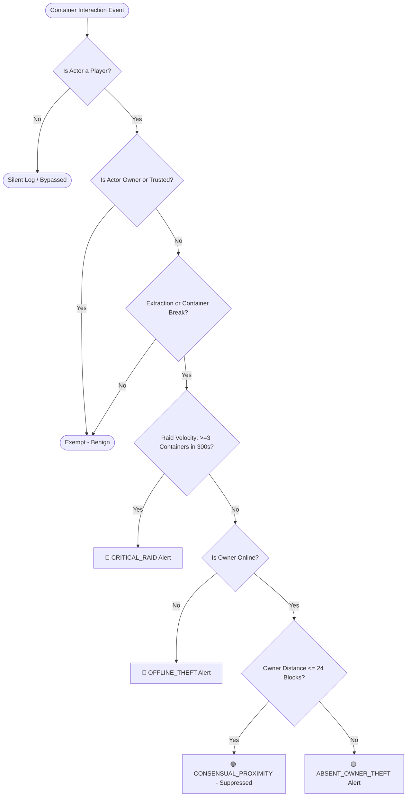
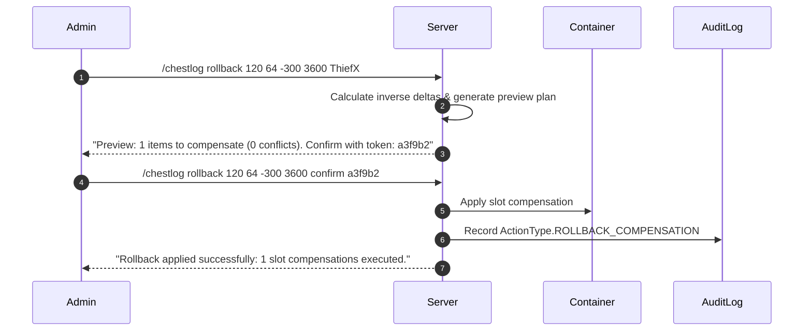

# 📦 ChestLogger — Complete Master Guide & Technical Reference

> **The Definitive Manual for Server Administrators, Moderators, and Developers**  
> *Target Platforms: Fabric Mod & Paper Plugin for Minecraft 26.2 (Pure Java 25)*

---

## 📑 Table of Contents
1. [System Architecture & Storage Engine](#1-system-architecture--storage-engine)
2. [Tracked Containers, Actions & Actors](#2-tracked-containers-actions--actors)
3. [Master Command & Permission Reference](#3-master-command--permission-reference)
4. [Visual Inspection & GUI Navigation](#4-visual-inspection--gui-navigation)
5. [Container Ownership & Player Trust System](#5-container-ownership--player-trust-system)
6. [Smart Theft & Raid Detection Engine](#6-smart-theft--raid-detection-engine)
7. [Item Provenance & Chain of Custody (Item Tracing)](#7-item-provenance--chain-of-custody-item-tracing)
8. [Safe Non-Destructive Rollback Engine](#8-safe-non-destructive-rollback-engine)
9. [In-Game Configuration & Hot-Reload Suite](#9-in-game-configuration--hot-reload-suite)
10. [Discord Webhook Security Alerts](#10-discord-webhook-security-alerts)
11. [Embedded Web Admin Dashboard & REST API](#11-embedded-web-admin-dashboard--rest-api)
12. [Operational Moderator Playbooks (Real-World Scenarios)](#12-operational-moderator-playbooks-real-world-scenarios)

---

## 1. System Architecture & Storage Engine

ChestLogger is built from the ground up to provide zero-tick-lag container transaction tracking, anti-griefing protection, raid detection, and forensic item tracing.

```
                                 THE ZERO-LAG ARCHITECTURE PIPELINE
+---------------------------------------------------------------------------------------------------+
|  MINECRAFT MAIN SERVER THREAD                                                                    |
|  Container Interaction (Player / Hopper / Redstone)                                              |
|      │                                                                                            |
|      ▼ (Sub-microsecond, Zero Lock)                                                               |
|  Lock-Free MPSC Ring Buffer (Concurrent Queue) ──────────────────────────┐                        |
+──────────────────────────────────────────────────────────────────────────┼────────────────────────+
                                                                           │
                                                                           ▼ (Asynchronous Thread)
+───────────────────────────────────────────────────────────────────────────────────────────────────+
|  CHESTLOGGER ASYNC WORKER POOL                                                                    |
|      ├─► LZ4 Append-Only Log Writer (Batched writes to .clog binary segments)                     |
|      │       └─► Tail CRC32 Checkpoint Checksum (Crash-safe, self-healing against SIGKILL)        |
|      ├─► Spatial Grid Indexer (.cidx binary index for <10ms chunk & coordinate lookups)           |
|      ├─► Smart Theft & Raid Evaluator (Sub-20ms heuristic evaluation)                             |
|      ├─► Discord Security Dispatcher (Asynchronous HTTPS Webhooks)                                |
|      └─► Embedded HTTP Web Server (Port 8080 REST API & Single Page Dashboard)                    |
+---------------------------------------------------------------------------------------------------+
```

### Storage Engine Internals
* **`.clog` Binary Storage:** Transaction logs are serialized into dense binary formats and compressed on-the-fly using LZ4. This avoids heavy database management systems (SQLite, MySQL, PostgreSQL) and eliminates disk seek storms on mechanical HDDs or budget shared hosting.
* **`.cidx` Spatial Index:** Packed 64-bit coordinate keys map directly to binary offset pointers, allowing instant historical lookups even across years of accumulated log segments.
* **Crash Resilience:** Every block segment terminates with a **Tail CRC32 Checkpoint**, enabling automatic tail-truncation and self-healing if the server process crashes mid-write.
* **100% Platform Portability:** Binary `.clog` and `.cidx` files can be moved between a Paper server and a Fabric server with seamless compatibility.

---

## 2. Tracked Containers, Actions & Actors

### Supported Container Types
* **Chests & Double Chests** (Automatically linked as single 54-slot logical containers)
* **Trapped Chests & Double Trapped Chests**
* **Barrels**
* **Shulker Boxes** (All 16 dye colors + undyed)
* **Crafters** (Minecraft 1.21+ autonomous crafting blocks)

---

### Tracked Action Types (`ActionType`)
| Wire ID | Action Type | Exact Trigger Mechanism |
|---|---|---|
| `0x00` | `CONTAINER_OPEN` | Player right-clicks and opens the container GUI. |
| `0x01` | `CONTAINER_CLOSE` | Player closes the container inventory screen. |
| `0x02` | `PICKUP` | Left/Right-click cursor pickup of an item stack from a slot. |
| `0x03` | `PLACE` | Left/Right-click placement of cursor item stack into a slot. |
| `0x04` | `SHIFT_CLICK_EXTRACT` | Shift-clicking an item out of a container into player inventory. |
| `0x05` | `SHIFT_CLICK_INSERT` | Shift-clicking an item from player inventory into a container. |
| `0x06` | `HOTBAR_SWAP` | Pressing a hotbar number key (1–9) or Offhand (`F`) over a container slot. |
| `0x07` | `DRAG_SPLIT` | Holding click and dragging items across multiple container slots. |
| `0x08` | `DOUBLE_CLICK_COLLECT` | Double-clicking an item stack to collect all matching items from the container. |
| `0x09` | `HOPPER_EXTRACT` | A hopper pulling an item downward or sideways out of a container. |
| `0x0A` | `HOPPER_INSERT` | A hopper pushing an item into a container. |
| `0x0B` | `DROP_FROM_SLOT` | Pressing `Q` or `Ctrl+Q` while hovering over a slot inside the container. |
| `0x0C` | `ROLLBACK_COMPENSATION` | Automated item compensation executed by a staff `/chestlog rollback` command. |
| `0x0D` | `CONTAINER_BREAK` | Container broken by a player, tool, explosion, or physics update. |
| `0x0E` | `CONTAINER_PLACE` | Container placed by a player (establishes base ownership). |
| `0x0F` | `CRAFTER_CRAFT` | Automated item recipe crafted and dispensed by a Crafter block. |

---

### Tracked Actor Types (`ActorType`)
| Wire ID | Actor Type | Description |
|---|---|---|
| `0x00` | `PLAYER` | Initiated by an authenticated online Minecraft player. |
| `0x01` | `HOPPER_BLOCK` | Standard Hopper block transferring items. |
| `0x02` | `HOPPER_MINECART` | Minecart with Hopper transferring items. |
| `0x03` | `DROPPER_DISPENSER` | Dropper or Dispenser block interaction. |
| `0x04` | `AUTOMATION` | Generic redstone, pistons, or modded automation. |
| `0x05` | `ADMIN_COMMAND` | Admin command executions (e.g. rollbacks). |
| `0x06` | `CRAFTER` | Autonomous Crafter block. |
| `0x07` | `ENVIRONMENT` | World physics, TNT explosions, Creeper blasts, or lightning. |

---

## 3. Master Command & Permission Reference

> **Base Commands:** `/chestlog` or `/cl`  
> **Fabric Security:** Administrative commands require Operator Level 2+. Trust and claim commands are open to all players.  
> **Paper Security:** Granular Bukkit permission nodes with `chestlogger.admin` as the administrative master wildcard.

```
                                  COMMAND TREE OVERVIEW
/chestlog (or /cl)
  ├── i / inspect ──────┬── [none] (Toggle inspect click mode)
  │                     ├── <x> <y> <z> [page]
  │                     └── <x> <y> <z> <player> [page]
  ├── wand ─────────────┴── (Display wand details & quick instructions)
  ├── trace ────────────┬── [none] / hand (Trace main-hand item provenance)
  │                     └── <x> <y> <z> [slot] (Trace item in container slot)
  ├── claim ────────────┬── [none] (Claim targeted container)
  │                     └── <radius> (1-32) (Admin batch claim)
  ├── unclaim ──────────┴── (Remove claim on targeted container)
  ├── trust ────────────┬── <player> (Trust teammate to access your containers)
  ├── untrust ──────────┼── <player> (Revoke trust)
  └── trustlist ────────┴── (List your trusted players)
  ├── rollback ─────────┬── <x> <y> <z> <seconds> [player] (Stage 1: Preview)
  │                     └── <x> <y> <z> <sec> confirm <token> (Stage 2: Execute)
  ├── stats ────────────┴── (Display live queue, saturation & index telemetry)
  ├── purge ────────────┬── <days> (Generate purge confirmation token)
  │                     └── <days> <token> (Execute permanent segment purge)
  ├── config / settings ┬── [none] (Open in-game interactive GUI)
  │                     ├── reload (Hot-swap configs from disk)
  │                     ├── get <key> (Query specific config value)
  │                     └── set <key> <value> (Update setting immediately)
  └── web ──────────────┴── [start|stop] (Paper: Manage embedded web server)
```

### Full Permission & Execution Table
| Command Syntax | Permission (Paper) | Environment | Description |
|---|---|---|---|
| `/chestlog i` | `chestlogger.inspect` | Player Only | Toggle click inspection mode on/off. |
| `/chestlog inspect <x> <y> <z> [page]` | `chestlogger.inspect` | Player / Console | Paginated transaction history for container at `(X,Y,Z)`. |
| `/chestlog inspect <x> <y> <z> <player> [page]` | `chestlogger.inspect` | Player / Console | Filter container history at `(X,Y,Z)` for `<player>`. |
| `/chestlog wand` | `chestlogger.inspect` | Player / Console | View configured wand item name and controls. |
| `/chestlog trace` *(or `trace hand`)* | `chestlogger.inspect` | Player Only | Reconstruct provenance for item in main hand. |
| `/chestlog trace <x> <y> <z> [slot]` | `chestlogger.inspect` | Player / Console | Reconstruct provenance for item in container slot. |
| `/chestlog claim` | *(Default: All)* | Player Only | Claim ownership of targeted container. |
| `/chestlog claim <radius>` | `chestlogger.admin` | Player Only | Batch claim all containers within `<radius>` blocks. |
| `/chestlog unclaim` | *(Default: All)* | Player Only | Remove claim on targeted container. |
| `/chestlog trust <player>` | `chestlogger.trust` | Player Only | Trust a player to exempt them from theft alerts. |
| `/chestlog untrust <player>` | `chestlogger.trust` | Player Only | Revoke trust from a player. |
| `/chestlog trustlist` | `chestlogger.trust` | Player Only | Display all players you currently trust. |
| `/chestlog rollback <x> <y> <z> <sec> [player]` | `chestlogger.rollback` | Player / Console | **Stage 1 (Preview):** Generate compensation plan & token. |
| `/chestlog rollback <x> <y> <z> <sec> confirm <token>` | `chestlogger.rollback` | Player / Console | **Stage 2 (Execute):** Apply rollback compensation. |
| `/chestlog stats` | `chestlogger.stats` | Player / Console | View queue depth, enqueued/drained events & index size. |
| `/chestlog purge <days> [confirmToken]` | `chestlogger.purge` | Player / Console | 2-step safe purging of logs older than `<days>`. |
| `/chestlog config` *(or `settings`)* | `chestlogger.admin` | Player Only | Open the interactive In-Game Configuration GUI. |
| `/chestlog config reload` | `chestlogger.admin` | Player / Console | Hot-reload all configurations from disk. |
| `/chestlog config get <key>` | `chestlogger.admin` | Player / Console | Query a specific configuration value. |
| `/chestlog config set <key> <val>` | `chestlogger.admin` | Player / Console | Update a configuration setting in real time. |
| `/chestlog web [start\|stop]` | `chestlogger.web` | Player / Console | Manage the embedded HTTP web dashboard server. |

---

## 4. Visual Inspection & GUI Navigation

### Inspection Controls
When you run `/chestlog i`, inspect mode is activated:
* **LEFT-CLICK a container:** Instantly prints formatted transaction lines to chat.
* **RIGHT-CLICK a container:** Opens the dedicated interactive Visual GUI.

```
+----------------------------------------------------------------------------------------------------+
|                                    FABRIC CLIENT GUI (ChestLogScreen)                              |
+----------------------------------------------------------------------------------------------------+
|  [Search Item: diamond...]  [Search Player: Alice...]                      [Page: < 1 / 4 >]       |
+----------------------------------------------------------------------------------------------------+
|  [ICON]  minecraft:diamond_sword   | SHIFT_CLICK_EXTRACT (-1)  | by SuspectX  | 2 mins ago         |
|  [ICON]  minecraft:enchanted_book  | PICKUP (-1)               | by Alice     | 14 mins ago        |
|  [ICON]  minecraft:netherite_ingot | PLACE (+16)               | by Bob       | 1 hour ago         |
|  [ICON]  minecraft:emerald_block   | DOUBLE_CLICK_COLLECT (-64)| by ThiefGuy  | 3 hours ago        |
+----------------------------------------------------------------------------------------------------+
|  [Teleport to Location]                       [Rollback Target]                    [Close (ESC)]   |
+----------------------------------------------------------------------------------------------------+
```

```
+----------------------------------------------------------------------------------------------------+
|                                    PAPER SERVER GUI (PaperChestHistoryView)                        |
+----------------------------------------------------------------------------------------------------+
|  [Slot 00] [Slot 01] [Slot 02] [Slot 03] [Slot 04] [Slot 05] [Slot 06] [Slot 07] [Slot 08]         |
|  [Slot 09] [Slot 10] [Slot 11] [Slot 12] [Slot 13] [Slot 14] [Slot 15] [Slot 16] [Slot 17]         |
|  [Slot 18] [Slot 19] [Slot 20] [Slot 21] [Slot 22] [Slot 23] [Slot 24] [Slot 25] [Slot 26]         |
|  [Slot 27] [Slot 28] [Slot 29] [Slot 30] [Slot 31] [Slot 32] [Slot 33] [Slot 34] [Slot 35]         |
|  [Slot 36] [Slot 37] [Slot 38] [Slot 39] [Slot 40] [Slot 41] [Slot 42] [Slot 43] [Slot 44]         |
|  [◄ PREV]  [GLASS]   [GLASS]   [GLASS]   [INFO]    [GLASS]   [GLASS]   [GLASS]   [NEXT ►]         |
+----------------------------------------------------------------------------------------------------+
|  Hovering over an item reveals:                                                                    |
|  - Action: SHIFT_CLICK_EXTRACT (-32)                                                               |
|  - Actor: Alice (Player)                                                                           |
|  - Time: 2026-08-18 21:10:00 (12m ago)                                                             |
|  - Container Slot: #0                                                                              |
|  - 64-bit Fingerprint: 0x4A1F89B2CD0012E4                                                          |
+----------------------------------------------------------------------------------------------------+
```

---

## 5. Container Ownership & Player Trust System



### Ownership Rules
1. **Auto-Claim on Place:** When a player places a chest or barrel, ownership is registered to their UUID.
2. **Double Chest Synchronization:** Claiming one half of a double chest automatically registers the connected half.
3. **Admin Radius Claiming:** Admins can run `/chestlog claim 20` to claim all containers within a 20-block radius for community hubs or admin shops.
4. **Trust Graph:** Player trust is directional ($A \rightarrow B$). If Player A trusts Player B, Player B can withdraw any items from Player A's chests without triggering security incidents or Discord webhooks.

---

## 6. Smart Theft & Raid Detection Engine

ChestLogger evaluates container transactions in **sub-20ms latency** against **5 security heuristics**:



### Incident Classifications Breakdown
* **`CRITICAL_RAID` (Threat: Critical | Color: Crimson):** Actor looted $\ge 3$ distinct container locations within a sliding 300-second window. Triggers high-priority alerts regardless of item value.
* **`OFFLINE_THEFT` (Threat: High | Color: Crimson):** Items extracted or container broken while registered owner is **Offline**.
* **`ABSENT_OWNER_THEFT` (Threat: Medium | Color: Orange):** Items extracted while owner is online but $>24$ blocks away (or in a different dimension).
* **`CONSENSUAL_PROXIMITY` (Threat: Benign | Suppressed):** Items extracted while owner is co-present ($\le 24$ blocks away). Suppressed to prevent alert spam during consensual trading.
* **`UNCLAIMED_NATURAL` (Threat: None):** Interactions with wilderness/world-gen containers.

### Real-Time Admin In-Game Alert Cards
When an alert triggers, all online operators receive:
1. **Action-Bar Warning:** `[ALERT] OFFLINE_THEFT at [120, 64, -300] by Steve`
2. **Interactive Chat Card:**
   ```text
   [ChestLogger] OFFLINE_THEFT: Steve extracted 32x minecraft:diamond from offline owner Alice [Teleport] [Inspect] [Trust]
   ```
   * Click **`[Teleport]`** $\rightarrow$ Teleports admin directly to container coordinates.
   * Click **`[Inspect]`** $\rightarrow$ Opens the inspection view for that container.
   * Click **`[Trust]`** $\rightarrow$ Quickly adds the actor to the owner's trust list if confirmed legitimate.

---

## 7. Item Provenance & Chain of Custody (Item Tracing)

Item Provenance reconstructs the complete lifecycle journey of an item across containers, player inventories, and hoppers with **Zero World Mutation** (no NBT tagging required).

```
                                 ITEM PROVENANCE DAG JOURNEY
+---------------------------------------------------------------------------------------------------+
|  STEP 1: [EXACT] CONTAINER_PLACE by CrafterGuy at [100, 64, 200] (minecraft:overworld)           |
|      │                                                                                            |
|      ▼                                                                                            |
|  STEP 2: [EXACT] SHIFT_CLICK_EXTRACT (-1) by Alice at [100, 64, 200]                              |
|      │                                                                                            |
|      ▼                                                                                            |
|  STEP 3: [EXACT] PLACE (+1) by Alice into Chest at [-50, 70, 310]                                  |
|      │                                                                                            |
|      ▼                                                                                            |
|  STEP 4: [EXACT] HOPPER_EXTRACT (-1) by Hopper into Minecart at [-50, 69, 310]                    |
|      │                                                                                            |
|      ▼                                                                                            |
|  STEP 5: [EXACT] SHIFT_CLICK_EXTRACT (-1) by SuspectX at [-50, 69, 310]                          |
+---------------------------------------------------------------------------------------------------+
```

### Non-Fungible vs Fungible Tracking Engine
1. **Non-Fungible Items (Armor, Tools, Weapons, Elytras, Shulker Boxes):**
   * Uses **64-bit Component Fingerprinting** (`MetadataFingerprint`) hashing enchantments, custom names, durability, trims, and shulker box contents.
   * Resolves unbroken chains of custody with **`EXACT_LINKAGE` (100% confidence)**.
2. **Fungible Commodities (Diamonds, Netherite Ingots, Gold, Iron):**
   * Employs spatio-temporal flow analysis ($\Delta t \le 5\text{m}$, $\Delta d \le 32\text{ blocks}$).
   * Scores transitions as **`HIGH_CONFIDENCE` (80–95%)** or **`PROBABLE` (50–75%)**.

### Tracing Commands
* **Trace Item in Hand:** `/chestlog trace hand` (or `/cl trace`).
* **Trace Container Slot:** `/chestlog trace <x> <y> <z> <slotNumber>`.

---

## 8. Safe Non-Destructive Rollback Engine

Traditional loggers perform full block replacement rollbacks, which delete items placed *after* a theft. ChestLogger uses **Differential Slot Compensation**.

```
SCENARIO: Thief steals 32 Diamonds at 12:00. Innocent Player puts 16 Emeralds at 12:05.
-----------------------------------------------------------------------------------------
TRADITIONAL BLOCK OVERWRITE:
  Replaces entire chest with 12:00 snapshot -> ❌ Emeralds are completely deleted!

CHESTLOGGER DIFFERENTIAL COMPENSATION:
  Calculates delta (+32 Diamonds) and restores them into an empty slot -> ✅ Emeralds preserved!
```

### Staged 2-Step Rollback Workflow



---

## 9. In-Game Configuration & Hot-Reload Suite

Admins can configure ChestLogger in real-time via GUI or CLI without restarting the server.

### Configuration Commands
```bash
# Open interactive In-Game GUI
/chestlog config

# Hot-reload all configurations from disk
/chestlog config reload

# Query specific setting value
/chestlog config get webhook
/chestlog config get cooldown
/chestlog config get owner_distance

# Update setting in real time
/chestlog config set webhook https://discord.com/api/webhooks/...
/chestlog config set owner_distance 32
/chestlog config set web_enabled true
/chestlog config set web_port 8080
```

---

## 10. Discord Webhook Security Alerts

### Configuration File (`config/chestlogger_alerts.json`)
```json
{
  "enabled": true,
  "webhookUrl": "https://discord.com/api/webhooks/YOUR_ID/YOUR_TOKEN",
  "botUsername": "ChestLogger Security Bot",
  "avatarUrl": "https://raw.githubusercontent.com/Sayanthegamer/Chestlogger-mod/master/docs/banner.png",
  "quantityThreshold": 32,
  "alertOnContainerBreak": true,
  "alertOnValuableTheft": true,
  "rateLimitPerMinute": 30,
  "valuableItems": [
    "minecraft:diamond",
    "minecraft:diamond_block",
    "minecraft:netherite_ingot",
    "minecraft:netherite_block",
    "minecraft:elytra",
    "minecraft:beacon",
    "minecraft:shulker_box",
    "minecraft:totem_of_undying"
  ]
}
```

---

## 11. Embedded Web Admin Dashboard & REST API

ChestLogger embeds a zero-dependency web server (Default: `http://localhost:8080/`).

### REST API Reference
> All REST requests require the authentication header: `X-ChestLogger-Auth: <secretToken>`

| Endpoint | Method | Query Parameters | Description |
|---|---|---|---|
| `/api/v1/health` | `GET` | *(None)* | Server health check and authentication test. |
| `/api/v1/stats` | `GET` | *(None)* | Live telemetry: queue depth, throughput, dropped events, index size. |
| `/api/v1/incidents` | `GET` | `classification`, `limit` | Stream evaluated security incidents with filters. |
| `/api/v1/query` | `GET` | `x`, `y`, `z`, `dim`, `player`, `item`, `page`, `limit` | Paginated transaction query engine. |
| `/api/v1/provenance` | `GET` | `x`, `y`, `z`, `dim`, `item`, `fingerprint` | Reconstructs directed item provenance graph (nodes & edges). |
| `/api/v1/export` | `GET` | `format` (`csv` or `json`), `since`, `limit` | Streams audit logs as RFC 4180 CSV or structured JSON. |

#### Example REST API Calls:
```bash
# Query recent Critical Raid incidents
curl -H "X-ChestLogger-Auth: SECRET_TOKEN" \
     "http://localhost:8080/api/v1/incidents?classification=CRITICAL_RAID&limit=50"

# Query container history at specific coordinates
curl -H "X-ChestLogger-Auth: SECRET_TOKEN" \
     "http://localhost:8080/api/v1/query?x=120&y=64&z=-300&dim=minecraft:overworld"

# Export container logs as CSV
curl -H "X-ChestLogger-Auth: SECRET_TOKEN" \
     "http://localhost:8080/api/v1/export?format=csv&since=86400" -o container_audit.csv
```

---

## 12. Operational Moderator Playbooks (Real-World Scenarios)

### Playbook A: Investigating a Reported Base Theft
1. Teleport to victim coordinates: `/tp <x> <y> <z>`.
2. Run `/chestlog i` to enable inspect mode.
3. **Right-click** the chest to view transaction history in the visual GUI.
4. Note the thief's username and the timestamp.
5. Preview compensation rollback:
   ```bash
   /chestlog rollback <x> <y> <z> 86400 <ThiefName>
   ```
6. Review the preview and apply the rollback using the generated confirmation token:
   ```bash
   /chestlog rollback <x> <y> <z> 86400 confirm <token>
   ```

### Playbook B: Active Multi-Container Raid
1. In-game alert pops up: `[ChestLogger] CRITICAL_RAID: SuspectX looting multiple containers`.
2. Click **`[Teleport]`** directly from the chat card to arrive at the raid scene.
3. Click **`[Inspect]`** on the raided containers to review stolen loot.
4. Take appropriate administrative action against `SuspectX`.

### Playbook C: Tracing Stolen / Duplicated High-Value Gear
1. Hold the suspect item (e.g. Elytra, Netherite Sword) in your main hand.
2. Run `/chestlog trace hand`.
3. Read the chronological step graph:
   * **Step #1:** Identifies the original crafter and container origin.
   * **Intermediate Steps:** Shows every player, container, and hopper that handled the item.
   * **Final Step:** Shows how the item entered the suspect's possession.
